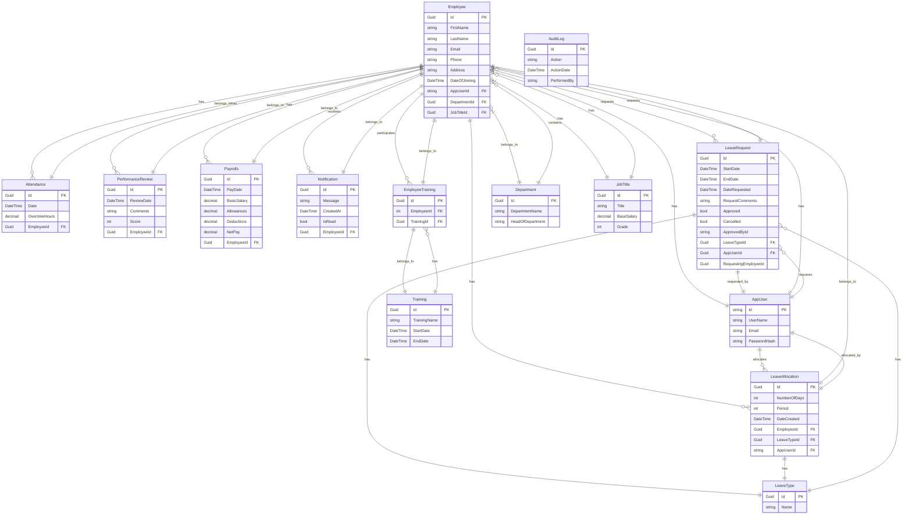

```mermaid
erDiagram
    Employee ||--o{ Attendance : has
    Employee ||--o{ PerformanceReview : has
    Employee ||--o{ Payrolls : has
    Employee ||--o{ Notification : receives
    Employee ||--o{ EmployeeTraining : participates
    Employee ||--o{ LeaveRequest : requests
    Employee ||--o{ LeaveAllocation : has
    Employee ||--|| AppUser : has
    Employee }|--|| Department : belongs_to
    Employee }|--|| JobTitle : has

    Department ||--o{ Employee : contains
    Department {
        Guid Id PK
        string DepartmentName
        string HeadOfDepartment
    }

    JobTitle ||--o{ Employee : has
    JobTitle {
        Guid Id PK
        string Title
        decimal BaseSalary
        int Grade
    }

    Employee {
        Guid Id PK
        string FirstName
        string LastName
        string Email
        string Phone
        string Address
        DateTime DateOfJoining
        string AppUserId FK
        Guid DepartmentId FK
        Guid JobTitleId FK
    }

    Payrolls ||--|| Employee : belongs_to
    Payrolls {
        Guid Id PK
        DateTime PayDate
        decimal BasicSalary
        decimal Allowances
        decimal Deductions
        decimal NetPay
        Guid EmployeeId FK
    }

    PerformanceReview ||--|| Employee : belongs_to
    PerformanceReview {
        Guid Id PK
        DateTime ReviewDate
        string Comments
        int Score
        Guid EmployeeId FK
    }

    Training ||--o{ EmployeeTraining : has
    Training {
        Guid Id PK
        string TrainingName
        DateTime StartDate
        DateTime EndDate
    }

    EmployeeTraining ||--|| Employee : belongs_to
    EmployeeTraining ||--|| Training : belongs_to
    EmployeeTraining {
        Guid Id PK
        int EmployeeId FK
        Guid TrainingId FK
    }

    LeaveRequest ||--o{ Employee : requests
    LeaveRequest ||--|| LeaveType : has
    LeaveRequest ||--|| AppUser : requested_by
    LeaveRequest {
        Guid Id PK
        DateTime StartDate
        DateTime EndDate
        DateTime DateRequested
        string RequestComments
        bool Approved
        bool Cancelled
        string ApprovedById
        Guid LeaveTypeId FK
        Guid AppUserId FK
        Guid RequestingEmployeeId
    }

    LeaveType ||--o{ LeaveRequest : has
    LeaveType {
        Guid Id PK
        string Name
    }

    LeaveAllocation ||--|| Employee : belongs_to
    LeaveAllocation ||--|| LeaveType : has
    LeaveAllocation ||--|| AppUser : allocated_by
    LeaveAllocation {
        Guid Id PK
        int NumberOfDays
        int Period
        DateTime DateCreated
        Guid EmployeeId FK
        Guid LeaveTypeId FK
        string AppUserId FK
    }

    AppUser ||--|| Employee : has
    AppUser ||--o{ LeaveAllocation : allocates
    AppUser ||--o{ LeaveRequest : requests
    AppUser {
        string Id PK
        string UserName
        string Email
        string PasswordHash
    }

    Notification ||--|| Employee : belongs_to
    Notification {
        Guid Id PK
        string Message
        DateTime CreatedAt
        bool IsRead
        Guid EmployeeId FK
    }

    Attendance ||--|| Employee : belongs_to
    Attendance {
        Guid Id PK
        DateTime Date
        decimal OvertimeHours
        Guid EmployeeId FK
    }

    AuditLog {
        Guid Id PK
        string Action
        DateTime ActionDate
        string PerformedBy
    }
``` 